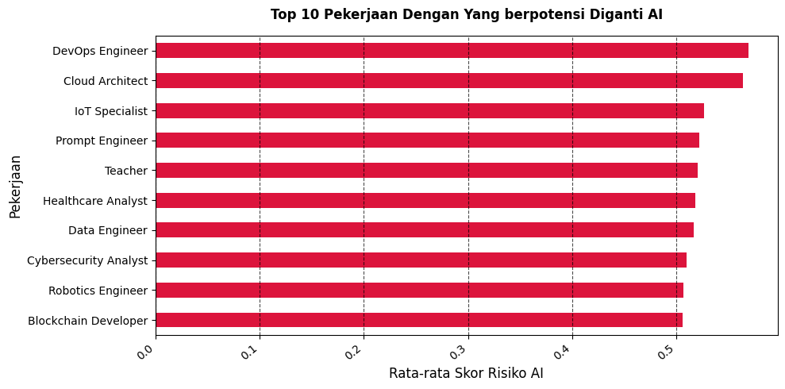
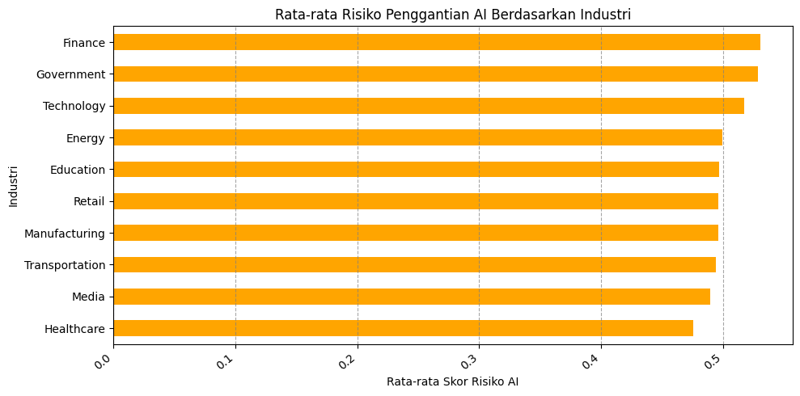
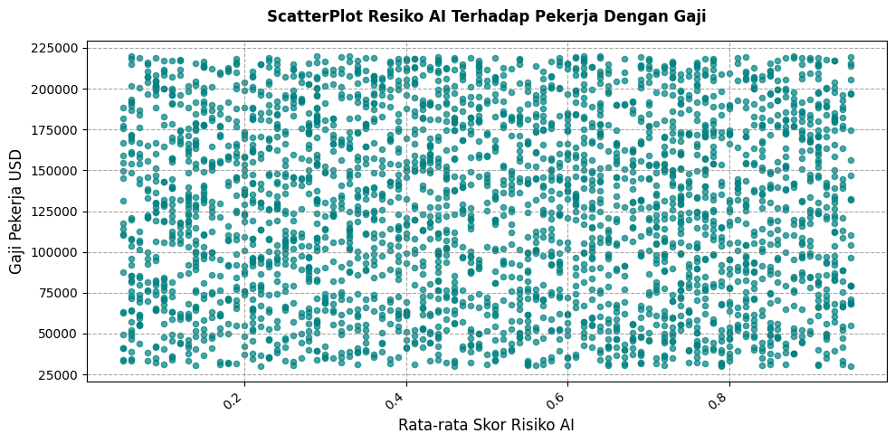
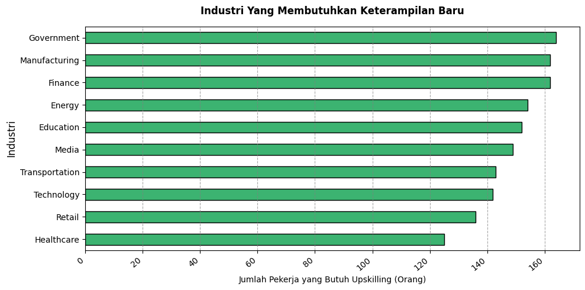

# Day 2: Analisis Kemungkinan Dampak AI Terhadap Pekerjaan Di 2030

**Dataset:** [Kaggle - Ai Impact in future on jobs market in 2030](https://www.kaggle.com/datasets/muhammadwaqas023/ai-impact-in-future-on-jobs-market-in-2030)

Jadi untuk day 2, saya menggunakan dataset dengan tema Kemungkinan dampak  AI terhadap pasar tenaga kerja di 2030. 

Sebelum memulai membuka dataset saya membuat 4 pertanyaan untuk dijawab berdasarkan dataset tersebut. Pertanyaannya ada 4 yaitu:
1. 10 pekerjaan apa saja yang memiliki rata-rata risiko digantikan oleh AI tertinggi dan terendah?
2. Apakah industri tertentu secara umum lebih rentan terhadap risiko AI dibandingkan industri lainnya?
3. Apakah pekerjaan dengan risiko AI tinggi cenderung memiliki rata-rata gaji yang lebih rendah, atau justru sebaliknya?
4. Di kelompok industri mana yang pekerjanya paling dinilai butuh meningkatkan keterampilan baru?

---

## Penggunaan AI
Terus bagaimana dengan penggunaan AI pada hari ini?, Untuk kali ini saya menggunakan AI untuk brainstorming beberapa pertanyaan serta untuk generate beberapa baris kode yang memang saya tidak ketahui cara membuatnya seperti scatter plot pada pertanyaan ke-3, kurang lebih ini penggunaan AI saya:

1. Membantu saya untuk brainstorming beberapa pertanyaan yang dirumuskan untuk analisis dataset itu
2. Penggunaan AI dalam menggenerate kode berkurang dibanding hari kemarin. Saya menggunakan AI untuk melakukan perbaikan beberapa baris yang saya  ketik sendiri dengan menggunakan referensi hari sebelumnya dan generate beberapa kode yang memang belum saya pelajari.
3. Saya sepenuhnya menggenerate kode visualisasi scatterplot menggunakan AI di pertanyaan ke-3 tapi tidak untuk detail detailnya seperti judul gambar.
4. Dipertanyaan ke-4 saya dipertemukan dengan konsep baru yaitu cara mengkuantisasikan nilai variabel boolean menjadi angka. Disini saya generate baris awal untuk membantu mengvisualisasikan bentuk boolean. sisanya ketik sendiri. 

---

## Hasil Analisis & Jawaban Pertanyaan

### !DISCLAIMER DATA INI MERUPAKAN DATA SINTESIS DARI KAGGLE DAN TIDAK MEREFLEKSIKAN KONDISI NYATA YANG ADA DILAPANGAN

### 1. 10 pekerjaan apa saja yang memiliki rata-rata risiko digantikan oleh AI tertinggi dan terendah

Tiga pekerjaan yang berpotensi digantikan AI berdasarkan dataset ini adalah Devops, Cloud Architect, & IoT Specialist. Jujur agak ngawur menurut saya, IoT specialist bagi saya sangat susah untuk digantikan oleh AI karena masih diperlukan manusia untuk merancang dan merakit desain IoT mulai dari PCB sampai Covernya.

Devops & Cloud apalagi, 2 Pekerjaan ini berhubungan langsung dengan infrastruktur AI. Bagaimana kita membuat Model AI yang bisa diakses secara online, tidak banyak bugnya, Dan scalable sangat dibutuhkan spesialist untuk menghandle itu.

Cuman karena data ini saya pakai hanya untuk belajar visualisasi data, maka setidaknya masih bisa dimaklumi lah

### 2. Apakah industri tertentu secara umum lebih rentan terhadap risiko AI dibandingkan industri lainnya?

Sekali lagi hasil visualisasi dataset ini menurut saya agak nguawor, Finance menduduki peringkat pertama sebagai industri yang rentan terhadap resiko AI, disusul dengan Goverment & Technology.

Menurut saya, Pekerjaan di Industri Finance sangat perlu bantuan manusia dalam proses keputusan akhir dalam merencakan sesuatu. Tech apalagi, industri yang menjadi cikal bakal terbentuknya AI sangat susah menurutku AI untuk mengganti pekerjaan di industri itu.

Dan sekali lagi data ini merupakan data sintetis yang saya ambil dari kaggle.

### 3. Apakah pekerjaan dengan risiko AI tinggi cenderung memiliki rata-rata gaji yang lebih rendah, atau justru sebaliknya?

Setelah membahas diagram ini dengan AI, bisa disimpulkan kalau data ini tidak menunjukkan korelasi gaji dengan resiko terkena dampak AI. Ini tidak merepresentasikan kondisi yang terjadi di lapangan karena menurut ai harusnya ada korelasi dengan dua kolom tersebut

### 4. Di kelompok industri mana yang pekerjanya paling dinilai butuh meningkatkan keterampilan baru?

Diletakkannya Goverment menjadi peringkat satu menurut saya sesuai dengan kondisi nyata di dunia pemerintah. Bekerjaan yang sangat repetitif yang dilakukan oleh banyak PNS sangat memungkinkan untuk diganti oleh AI. Oleh karena itu dibutuhkan kemampuan baru yang perlu dilatih agar tetap relevan di setiap tahunnya

---

Oke itu saja yang saya lakukan dalam day 2. Day 3 saya menargetkan kalau kita harus mulai sentuh data yang belum diolah, untuk melatih kemampuan data cleaning kita so stay tuned.
