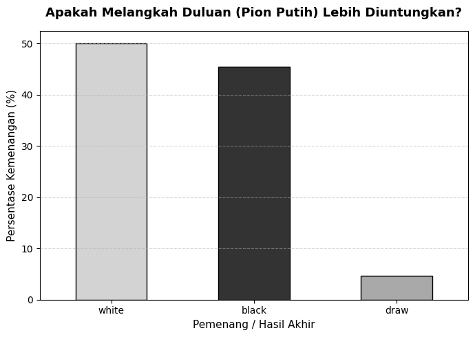
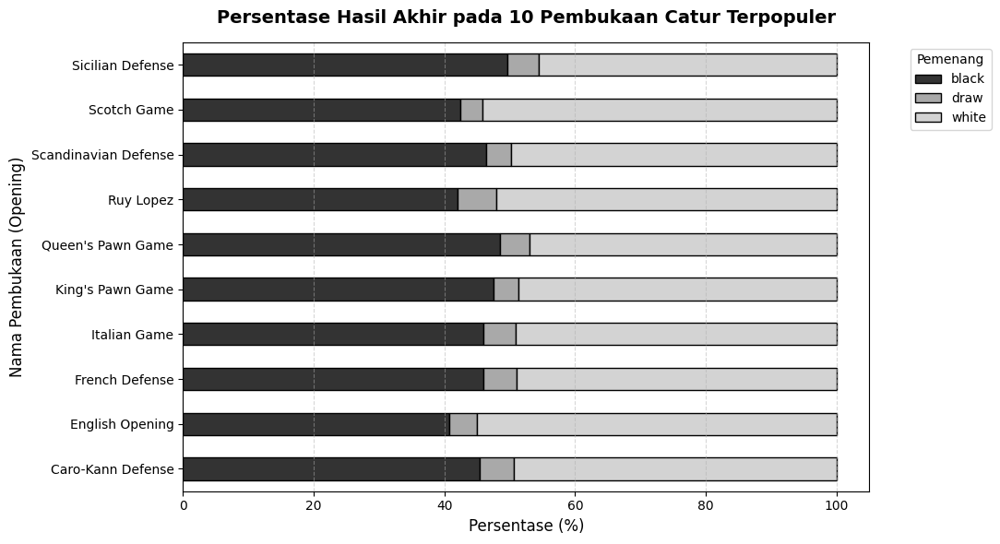
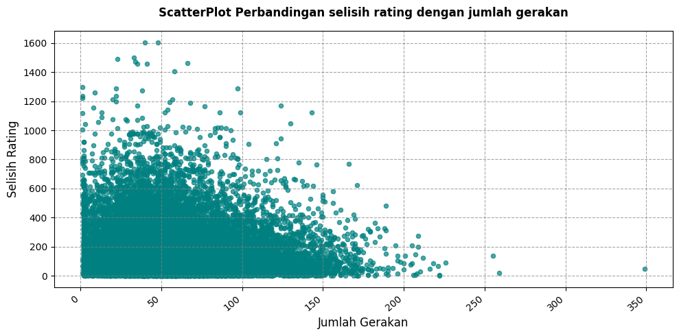

# Day 3:  

**Dataset:** [Kaggle - https://www.kaggle.com/datasets/datasnaek/chess](https://www.kaggle.com/datasets/datasnaek/chess)

Jadi untuk hari ini, saya menggunakan dataset catur yang saya dapat dari kaggle. Berdasarkan deskripsi, dataset ini diambil dari website lichess, jadi bisa dibilang data ini merupakan data asli yang diambil dari sebuah website catur.

Sebelum memulai masuk ke dataset saya membuat 3 pertanyaan untuk dijawab berdasarkan dataset tersebut. Pertanyaannya yaitu:
1. Apakah pemilihan hitam/putih berpengaruh pada peluang kemenangan?
2. Pembukaan apa yang memiliki persentase kemenangan yang tinggi?
3. Apakah selisih rating yang besar mempercepat durasi pertandingan?

---

## Penggunaan AI
Seperti yang saya katakan kemarin, untuk hari ini saya mencoba data yang usabilitynya dibawah 10 agar bisa belajar untuk cleaning data. Tapi jujur, saya tidak sangka kalau ternyata banyak sekali sintaks yang baru saya temui, dan karena itu mayoritas kode yang ada disini merupakan generated dari LLM Model. Berikut rinciannya:

1. Mayoritas kode merupakan fully generated yang saya ketik kembali kecuali visualisasi scatter plot yang saya tahu bagaimana cara menulisnya
2. Penggunaan LLM Model juga dibikin dalam merumuskan pertanyaan ketiga yang saya gunakan dalam hipotesis sementara

---

## Hasil Analisis & Jawaban Pertanyaan

### 1. Apakah pemilihan hitam/putih berpengaruh pada peluang kemenangan?

Didalam catur ada teori first mover advantage, yang dimana pemain yang memilih warna putih secara statistik lebih sering menang ketimbang warna hitam. Saya mencoba untuk membuktikannya dalam dataset ini dan hasilnya valid.

Dari 19rb++ permainan catur dalam dataset yang dianalisis, presentase kemenangan tim putih sebesar 49.94%, sedangkan presentase kemenangan hitam sebesar 45.41%, dan sisanya merupakan pertandingan seri. 

### 2. Pembukaan apa yang memiliki persentase kemenangan yang tinggi?

Berdasarkan statistik dari kumpulan game dalam dataset ini, pembukaan yang memiliki presentase kemenangan tertinggi bagi tim hitam adalah pembukaan pertahanan sicilian (sicilian defense) dengan presentase kemenangan hampir mencapai 50%, tapi walaupun begitu semua strategi yang sering dimainkan dalam dataset ini, semuanya tidak ada yang mencapai 50% atau lebih bagi tim hitam. 

Masih selaras dengan jawaban pertanyaan pertama, sebagai tim putih semua pembukaan mmemiliki peluang untuk menang lebih dari 50%. Walaupun begitu, Scotch game dan english opening memiliki presentase kemenangan jauh lebih banyak daripada pembukaan lainnya

### 3. Apakah selisih rating yang besar mempercepat durasi pertandingan?

Dalam diagram pencar ini, titik-titik terpusat pada pada area x 0 - 150, dan y 0 - 600 sebelum akhirnya memencar. Diagram ini menunjukkan kalau semakin sedikit selisih rating dalam sebuah pertandingan catur, maka pertandingan bisa mencapai rata rata sekitar 0-200 Gerakan

semakin tinggi selisih rating dalam sebuah permainan maka pertandunga bisa berakhir lebih cepat lagi sekitar 0 - 100 gerakan
---

Jujur agak kecewa karena saya rely dengan AI agak sering hari ini, tapi bukan berarti menjadi alasan untuk tidak belajar. Oleh karena itu, tetaplah konsisten untuk belajar
