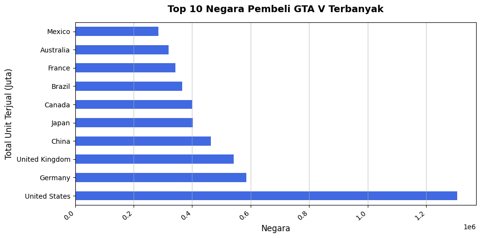
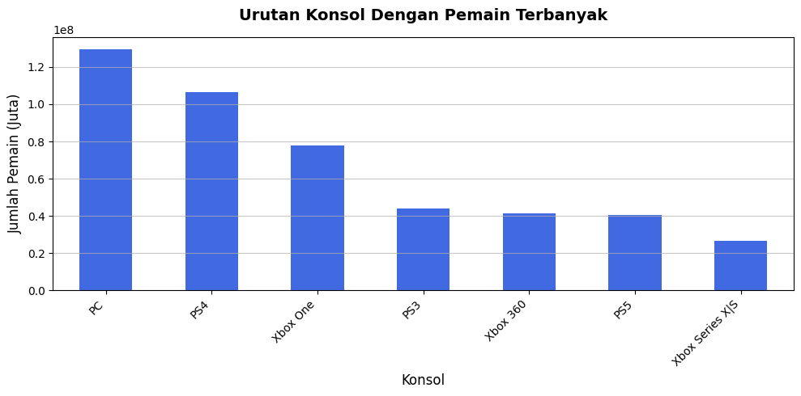
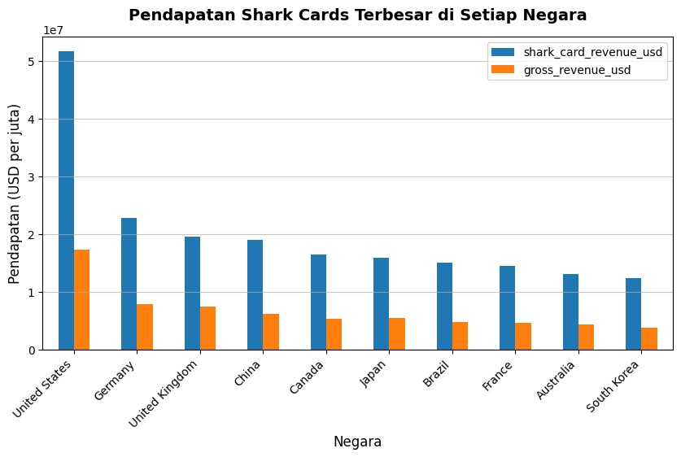
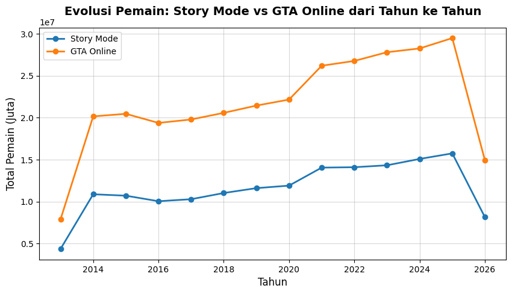

# Day 1: Analisis GTA V

**Dataset:** [Kaggle - GTA V Worldwide Sales and Player Analytics](https://www.kaggle.com/datasets/velvetcrystal/gta-v-worldwide-sales-and-player-analytics)

Jadi untuk hari pertama saya menggunakan dataset GTA V yang sintesis. Di dalam data ini kurang lebih isinya penjualan GTA V di berbagai dunia dan jumlah pemainnya.

Sebelum memulai membuka dataset saya membuat 4 pertanyaan untuk dijawab berdasarkan dataset tersebut. Pertanyaannya ada 4 yaitu:
1. Negara mana yang membeli produk terbanyak?
2. Platform apa yang paling sering dipakai oleh gamers untuk memainkan GTA V?
3. Apakah pendapatan dari Shark Cards lebih besar daripada pendapatan dari penjualan unit game dasar di negara-negara tertentu?
4. Estimasi Player Online vs Storymode dari Tahun ke-Tahun

---

## Penggunaan AI
Terus bagaimana dengan penggunaan AI? Untuk kali ini saya menggunakan AI untuk generate sel kode untuk semua pertanyaan dengan ketentuan sebagai berikut:

1. **Pertanyaan Pertama:** Full generate satu cell blok kodenya.
2. **Pertanyaan Kedua:** Menggunakan kembali generate kode yang diblok pertama dengan mengubah beberapa sintaks.
3. **Pertanyaan Ketiga:** Masih sama dengan poin 2.
4. **Pertanyaan Keempat:** Mirip dengan poin ke-2 dan 3 tapi saya minta generate visualisasinya karena saya kurang tau sintaksnya.

---

## Hasil Analisis & Jawaban Pertanyaan

### 1. Negara mana yang membeli produk terbanyak?

Negara dengan pembeli game GTA V terbanyak di dunia didominasi oleh Amerika Serikat. Amerika Serikat menduduki peringkat 1 sebagai pembeli game GTA V terbanyak dengan 1.2 kopi. Disusul oleh Jerman, Inggris, dan China.

### 2. Platform apa yang paling sering dipakai oleh gamers untuk memainkan GTA V?

PC/Komputer menduduki peringkat pertama sebagai platform dengan pemain terbanyak di game GTA V. Hipotesis saya sederhana, di PC sangat gampang memodifikasi game dengan meng-*reverse engineering* dan eksploit *source code* dari sebuah aplikasi. Dengan begitu sangat banyak mod-mod yang tersedia serta plugin-plugin yang membuat game semakin mengasyikkan untuk dimainkan.

### 3. Apakah pendapatan dari Shark Cards lebih besar daripada pendapatan dari penjualan unit game dasar di negara-negara tertentu?

Di negara manapun pendapatan Shark Cards lebih besar daripada penjualan unit game. Berdasarkan hal tersebut bisa disimpulkan kalau game tersebut mendapat *revenue* terbesarnya dari *microtransaction* yang ada didalam game ketimbang penjualan unit game.

### 4. Estimasi Player Online vs Storymode dari Tahun ke-Tahun

Dari 2014 sampai sekarang, player GTA yang bermain secara Online selalu lebih banyak dari pemain Story Mode. Dalam visualisasi menggunakan diagram garis, bisa diperhatikan kalau pemain GTA V Online selalu berada di atas pemain GTA V Storymode.

---

Oke itu saja yang saya lakukan dalam day pertama, Semoga ketemu di Hari selanjutnya!
