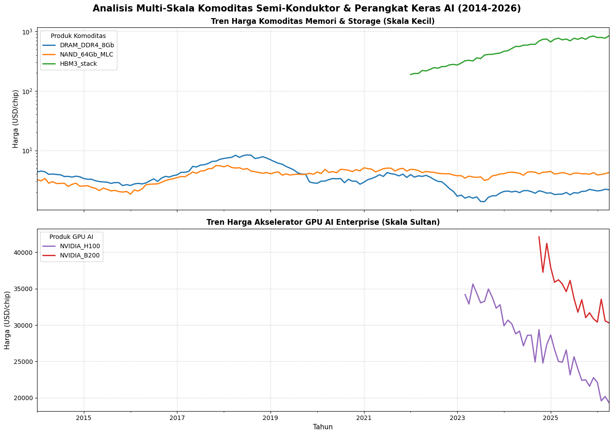

# Day 6: Time Series Analytics

**Dataset:** [Kaggle - Global Semi Conductor](https://www.kaggle.com/datasets/sergionefedov/global-semiconductor-industry-2010-2026?select=chip_prices.csv)

Jadi untuk hari 6 saya menggunakan dataset simpel karena sedikit waktu. Dari link kagglenya sih terdapat banyak dataset csv yang dikasih, tapi saya cuman milih 1 karena banyak kerjaan jadi kurang banyak waktu saya.

Pertanyaannya simpel, bagaimana perkembangan harga dari chip-chip yang ada didalam dataset.

tanpa berlama lama kita masuk ke pembahasan

---

## Penggunaan AI
Terus bagaimana dengan penggunaan AI?. Disini AI membantu saya mengenerate blok sel untuk mengvisualisasikan bentuk diagram garis untuk time series analyctis.

---

## Hasil Analisis & Jawaban Pertanyaan

### Bagaimana perkembangan harga dari chip-chip yang ada didalam dataset?

bagaimana perkembangan harga dari chip-chip yang ada didalam dataset.

Ok, jadi pertama saya membagi isi dataset tersebut menjadi dua diagram untuk menghindari distorsi harga yang membuat diagramnya tidak bisa dibaca.

Jdai ada beberapa penemuan menarik:

1. Harga DRAM DDR4 berfluktuasi dari 2014-2026, yang dimana mulai dari 2022 harganya mulai menurun, setelah diluncurkannya produk HBM3 Stack

2. Harga Nand 64GB stabil dari periode 2014-2026. dari grafik. NAND mencapai harga tertingginya pada tahun 2017-2018. Kemudian di tahun-tahun berikutnya mengalam penurunan dan kenaikan dirange situ.

3. Harga GPU AI enterprise menurun setiap tahunnya. Nvidia H100 mengalami penurunan yang sangat parah dimulai pada saat launchingnya sampai tahun ini, & perilisan NVIDIA B200 membuat gpu ini semakin turun drastis harganya 

---

Oke itu saja yang untuk hari ini, Semoga ketemu di Hari selanjutnya!
