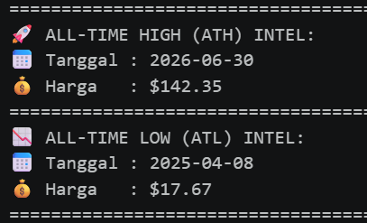
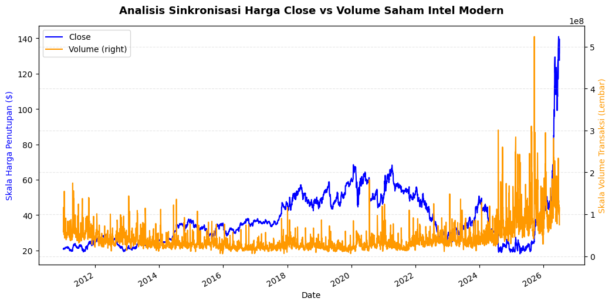
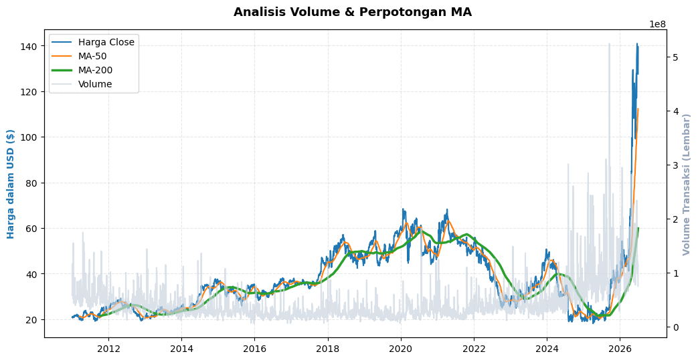

# Day 4: Saham Intel

**Dataset:** [Kaggle - Intel Stock Price History](https://www.kaggle.com/datasets/ivanvaccari/intc-stock-price-history)

Setelah doomscrolling mencari dataset untuk dianalisis, saya ketemu dataset yang sangat menarik karena beririsan dengan 2 minat saya (finance dan teknologi).

Menganalisis dataset ini memberikan saya a whole new thing tentang bagaimana role data scientist berperan dalam dalam industri finance.

Tbh, walaupun dataset ini sangat menarik buat dianalisis, tidak ada dibenak saya pertanyaan awal untuk dijawab. Jadi saya menganalisis basicnya seperti fitur dan kolomnya nya apa saja, dan membiarkan AI membantu saya mengarahkan ke analisis saya ke hal yang spesifik dan menarik buat dikulitin. 

disclaimer dlu, jangan mengambil mentah mentah hasil analisis saya karena saya cuman menggunakan dataset ini untuk belajar saja.

---

## Penggunaan AI
Terus bagaimana dengan penggunaan AI-nya kalau begitu?. Jujur dengan mencoba dataset ini, saya diperkenalkan dengan sintaks dan metode analisis yang baru seperti membandingkan dua garis atau lebih dengan time series analysis.

sayang sekali karena hari ini saya ngevibecode sangat banyak karena dipertemukan hal baru seperti mengekstrak informasi dari dataset itu, dan generate kode-kodenya untuk buat gambar.

---

## Hasil Analisis & Jawaban Pertanyaan

Sebelum masuk ke penemuan saya, Dataset ini mencatat pergerakan harga saham Intel dari 1980-hingga kini. Supaya relevan dengan kondisi sekarang, saya sengaja memotong datasetnya hingga menyisahkan data dari 2011-sekarang.

### 1. All Time High - All Time Low (2011-Sekarang)

Harga saham intel mencapai titik di harga $17 usd, dan merupakan titik terendahnya dalam 15 tahun terakhir.

Yang bikin menarik, setahun kemudian harga saham ini meningkat sebesar 7x lipat dari harga terendahnya. Tbh, kemungkinan besar kenaikan harga saham ini digerakkan karena tren AI (menurut saya). 

### 2. Harga close vs Volume

Digambar kedua, saya menyatukan Harga penutupan pada hari itu beserta dengan volume pasar dalam diagram garis.

Ada hal yang menarik, dalam rentang 2024-2026 Harga penutupan saham intel mengalami penurunan yang sangat tajam dan bertahan di range terendahnya.

Nah penurunan harga penutupan itu, dibarengin dengan volume yang sangat besar tanpa membuat harga saham itu naik. Menurut my gemini, Itu menunjukkan kalau terjadi akumulasi besar disaham intel karena kombinasi dari volume yang sangat tinggi tapi tidak dibarengi dengan kenaikan maupun penurunan harga.

Kondisi tersebut berlanjut sebelum akhirnya harga saham intel mulai breakout di sekitaran 2026 dan dibarengi dengan volume yang sangat masif dan memicu kenaikan harga yang sangayt signifikan

### 3. Volume vs Perpotongan MA (Moving Average)

Ada strategi untuk menemukan perubahan trend menggunakan MA 50 dan MA 200. Ketika MA 50 dan MA 200 saling cross ketika harga mengalami kenaikan setelah downtrend, itu menunjukkan kalau downtrend dari sebuah harga saham berakhir dan mulai merubah menuju uptrend. Begitupun sebaliknya, ketika terjadi penurunan harga setelah uptrend dan diiringan dengan cross antara kedua MA maka terjadi perubahan arah dari uptrend menuju downtrend

Nah, disini saya mencoba mencari korelasi antara volume ketika terjadi cross antar kedua MA. Hasilnya saya menemukan kalau, di beberapa titik terjadinya cross antara MA 50 dan MA 200 disertai dengan volume yang sangat kuat. Yang paling keliatan ketika terjadi cross menuju downtrend yang terjadi di antara 2020-2022. 

Ketika persilangan itu terjadi, Volume transaksi sangat besar dan membuat harga saham tersebut jatuh sangat jauh meskipun tidak sedalam pas 2025.

---

Oke itu saja yang saya lakukan dalam day keempat, Walapun kebanyakan vibecode. Saya merasa havefun dan mendapat banyak insight dalam dataset ini. 

Terakhir karena saya hanya mencoba-coba jangan sampai kalian mengambil mentah mentah hasil penemuan ini, perlu dicrosscheck terlebih dahulu dan research yang mendalam untuk mengonfirmasi hasil analisisku
