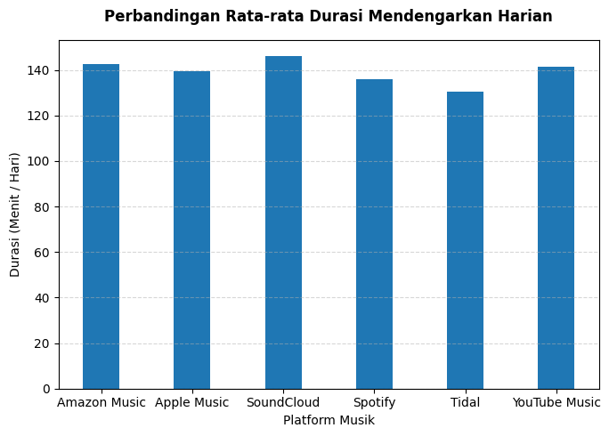
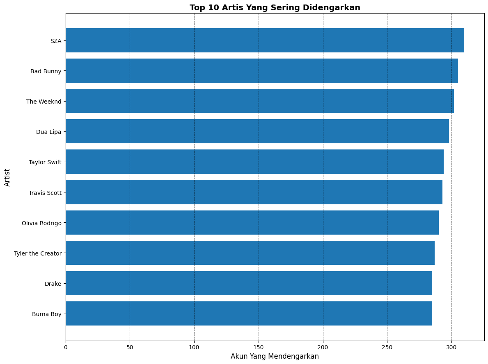
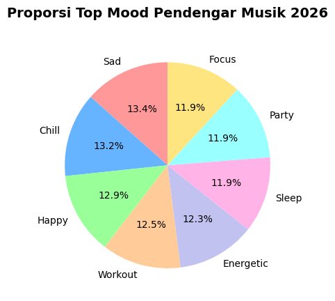

# Day 5: Analisis Kebiasaan Pendengar Musik 

**Dataset:** [Kaggle - Music Streaming Habits](https://www.kaggle.com/datasets/uditjain13/music-streaming-habits-2026)

Minta maaf karena telat. Saya ada urusan mendadak kemarin, jadi kita kembali lagi hari ini. 

Dataset kali ini saya mengambil yang gampangan dari kemaren-kemaren agar terbiasa dengan sintaks sintaks basicnya sebelum gelud lagi sama yang dataset yang susah.

Membuka dataset ini, saya merumuskan 3 pertanyaan untuk dijawab Yaitu:
1. Aplikasi apa yang digunakan oleh Pendengar musik yang paling banyak durasi dengarnya?
2. Artis apa yang paling sering dengar dari semua platform musik?
3. Para pendengar mendengarkan musik ketika moodnya seperti apa?

---

## Penggunaan AI
Disini saya menggunakan AI untuk melihat referensi kode untuk mengvisualisasikan & mengolah beberapa dataset untuk menjawab pertanyaan yang saya rumuskan.

Anyways, penggunaan ai agak sedikit hari ini.

---

## Hasil Analisis & Jawaban Pertanyaan

### 1. Aplikasi apa yang digunakan oleh Pendengar musik yang paling banyak durasi dengarnya?

Aplikasi platform music yang memiliki durasi pendengar harian terlama berada di soundcloud. Disusul oleh Amazon Music, & Youtube Music

### 2. Artis apa yang paling sering dengar dari semua platform musik?

Peringkat Pertama artis yang paling populer diduduki oleh SZA Dengan total 300++ pendengar. (Tbh walaupun ini sintesis tapi saya kurang tau juga siapa dia itu koawokawoakw), disusul oleh Bad Bunny & The Weekend 

### 3. Para pendengar mendengarkan musik ketika moodnya seperti apa?

Para pendengar musik lebih sering mendengarkan musik ketika Moodnya sedih, Santai, Dan Happy.

---

## Penutupan
Untuk hari ini sebenarnya saya mau banyak berteori dari menganalisis data tersebut, Namun karena data itu merupakan data sintesis. Jadi saya rasa tidak ada gunanya untuk berteori.

Soooo Sori hari ini agak pendek.

---
